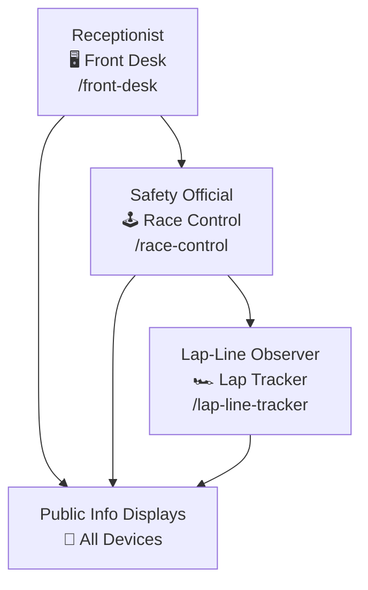

# 🏁 Racetrack Info-Screens

All-in-one real-time race information system. Built with **Node.js**, **Socket.IO**, and **SQLite**, this streamlined MVP empowers Beachside Racetrack to manage race sessions, ensure safety, and display live race data across multiple networked devices.


---

## ✨ Key Features

- ##### Complete Race Management
- ##### Real-Time Synchronization via `Socket.IO`
- ##### Secure Employee Interfaces
- ##### Persistent Race Data via `SQLite`
- ##### Multi-Network Accessibility via `tunnelmole`  
- ##### Auto-Launch Landing Page

---

## 🧩 Interface Roles

| Interface              | Key Capabilities                                     |
| ---------------------- | ---------------------------------------------------- |
| 🖥️ **Front Desk**     | Schedule races, assign/edit drivers, manage sessions |
| 🕹️ **Race Control**   | Start races, manage safety flags, control timer      |
| 🏎️ **Lap Tracker**    | Log laps via tappable car number buttons             |
| 📢 **Public Displays** | Next Race · Leaderboard · Countdown · Race Flags     |

---

## 🔐 Security & Access Control

Each employee interface is password-protected via environment variables.

|Interface|Username|Env Variable|
|---|---|---|
|`/front-desk`|`frontadmin`|`FRONT_DESK_PASSWORD`|
|`/race-control`|`raceadmin`|`RACE_CONTROL_PASSWORD`|
|`/lap-line-tracker`|`laplineadmin`|`LAP_LINE_PASSWORD`|

- Access is only granted after successful login  
    
- Login failures are delayed by 500ms to prevent brute force attacks  
    
- Server won’t start unless all keys are defined
    
- Passwords stored as bcrypt hashes in `keys.env`

---

## 📋 System Flow




---

## ⚙️ Tech Stack

- 🧠 **Backend:** Node.js + Express
    
- ⚡ **Real-time:** Socket.IO
    
- 💾 **Database:** SQLite (`sqlite3`)
    
- 🧩 **Frontend:** HTML, CSS, JavaScript(vanilla)
    
- 🔐 **Security:** bcrypt, express-session
    
- 🌐 **External Access:** tunnelmole
    
---

## 🛠️ Setup Instructions

### 📋 Prerequisites

Before installation, ensure you have:

- ✅ `Node.js` v22.14.0 installed
    
- ✅ `npm` installed
    
- ✅ A terminal/command-line interface
    
- ✅ Environment variable file `keys.env` prepared with access credentials (see below)

### 1️⃣ Clone + install dependencies:

```bash
git clone <repository-url>
cd <repository-directory>
npm install
```

---

### 2️⃣ Configure `keys.env`

Create a file called `keys.env` in the root:

```env
SESSION_SECRET=your_very_strong_secret

RACE_CONTROL_PASSWORD=<bcrypt hash> // default "safety"
FRONT_DESK_PASSWORD=<bcrypt hash> // default "front"
LAP_LINE_PASSWORD=<bcrypt hash> // default "lapline"
```

Generate a bcrypt hash:

```bash
node -e "console.log(require('bcrypt').hashSync('your_actual_password', 10))"
```

---

### 3️⃣ Start the server

#### Standard mode (10-min races)

```bash
npm start
```

#### Dev mode (1-min races)

```bash
npm run dev
```

- Server runs at `http://localhost:3000`
    
- A public URL (via tunnelmole) is printed to access from phones/tablets/other networks
    

---

## 📖 User Guide

### 🖥️ `/front-desk` — Receptionist

- Add//delete upcoming race sessions
    
- Add/edit/delete  drivers (max 8 per session)
    
- Assign drivers to cars, auto or manually

- See the full upcoming session queue

---

### 🕹️ `/race-control` — Safety Official

- View upcoming/current session details
    
- Press `"Safe to Start"` to prep drivers
    
- Start countdown, control race modes (Safe 🟢 | Hazard 🟡 | Danger 🔴 | Finish 🏁)
    
- End session → triggers next race 
    

---

### 🏎️ `/lap-line-tracker` — Observer

- Big, tappable buttons for each car
    
- Tap when car crosses lap line
    
- Auto-disables when race ends

---

### Public Display Interfaces run on large screens:

| Display             | Route             | Purpose                               |
| ------------------- | ----------------- | ------------------------------------- |
| 🥇 **Leader Board** | `/leader-board`   | Real-time rankings, flag, laps, timer |
| ⏱️ **Countdown**    | `/race-countdown` | Countdown clock                       |
| ⏭️ **Next Race**    | `/next-race`      | Shows who's racing next               |
| 🚩 **Race Flags**   | `/race-flags`     | Visual flag display                   |

All public displays have a **fullscreen button** 

---

## 💡Bonus features

#### 💾 Data Persistence

- Race sessions, drivers, lap data all persist in `racetrack.db`
- System resumes the correct state automatically after server restart.

❗If the server was intially started with `developer mode`, then it should also be restarted with the same mode for consistency in the timer logic.
#### 🖱️ Manual Car Assignment Option  
The Front Desk interface allows receptionists to manually assign each driver to a specific car number ahead of time, giving full control over session setup.

#### 👩🏽‍💻 User-Friendly Entry Point  

On startup, the server automatically opens a landing page in your default browser, providing quick access to all available interfaces.

---

## 🎉 Let’s Race!

Built for real-time speed⚡

**No pen.
No paper. 
Just racing.**

---
